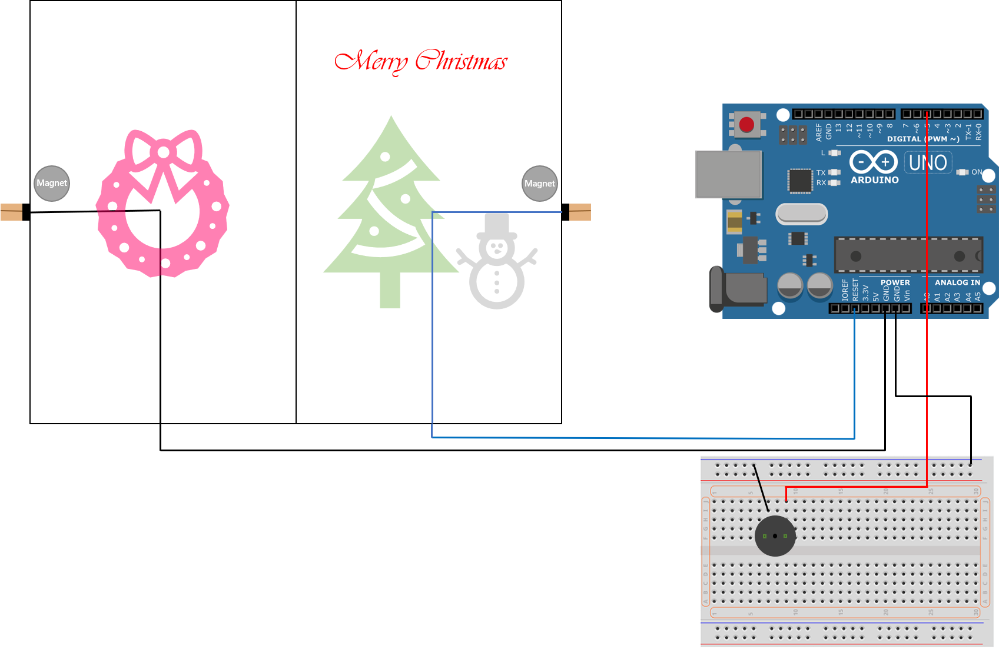

# XMasicCard
Christmas music card with Arduino Uno

## Specifications
### Scenarios
* When the recipient opens the Christmas Card, background music will be played automatically.
* Supports multiple songs, one randomly selected song will be played per time.

### Connections
* 1 x Micro-USB

## Apparatus (Equipments)
- Arduino Uno R3 + USB A-to-B Cable
- 1x Christmas Card
- 1x Breadboard
- 4x Jumper Wires
- 1x Piezo Buzzer
- 1x Copper Conductive Sticky Tape
- 1x Adhesive Transparent Sticky Tape
- 2x Magnets
- 1x Super Glue.
- 1x Portable Battery

## Circuit Diagram

## Code to Note
One of Arduino's many useful built-in commands is the tone() function. This function drives an output pin at a certain frequency, making it perfect for driving buzzers and speakers. If you give it a duration (in milliseconds), it will play the tone then stop. If you don't give it a duration, it will keep playing the tone forever (but you can stop it with another function, noTone()).

tone(PIEZO, notes[i], time[i]); 
